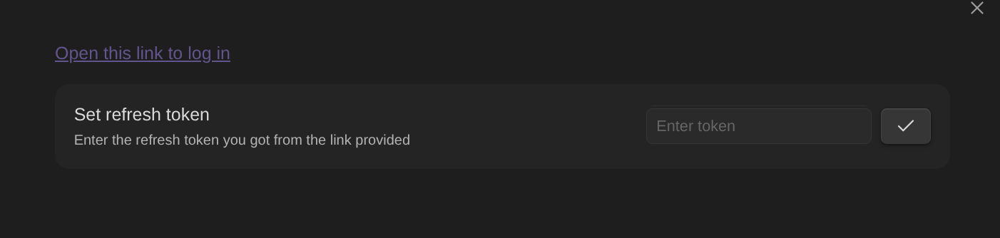
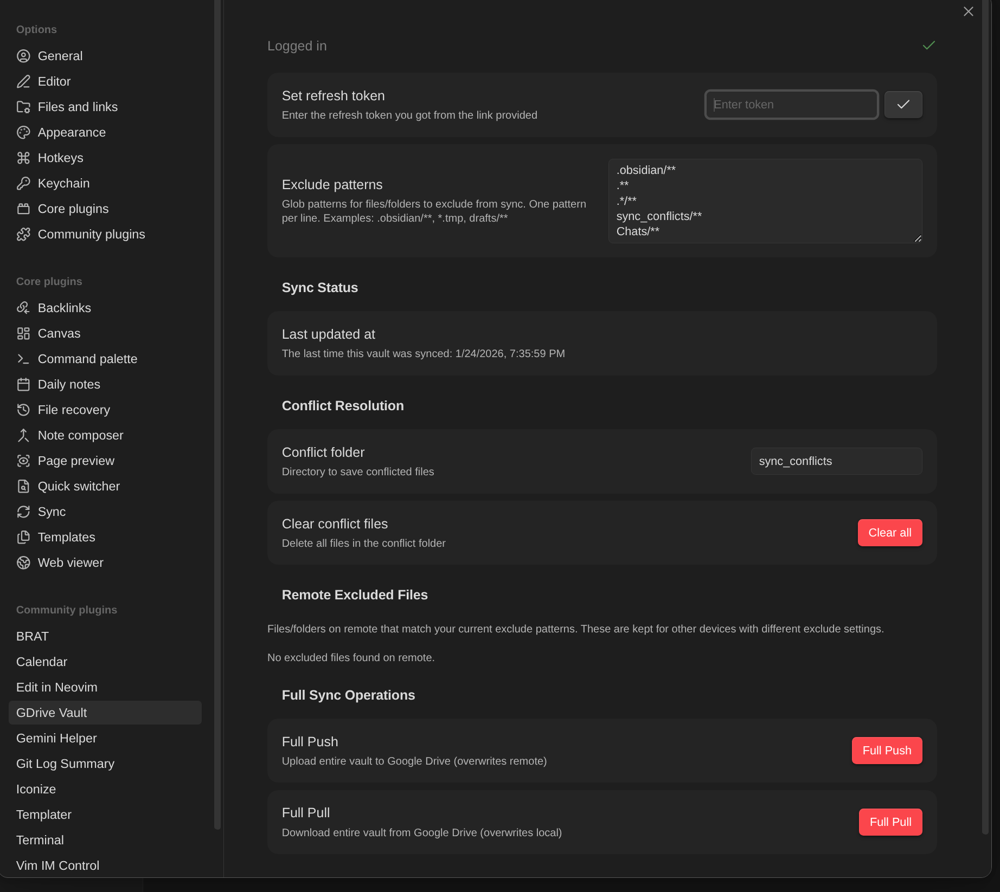
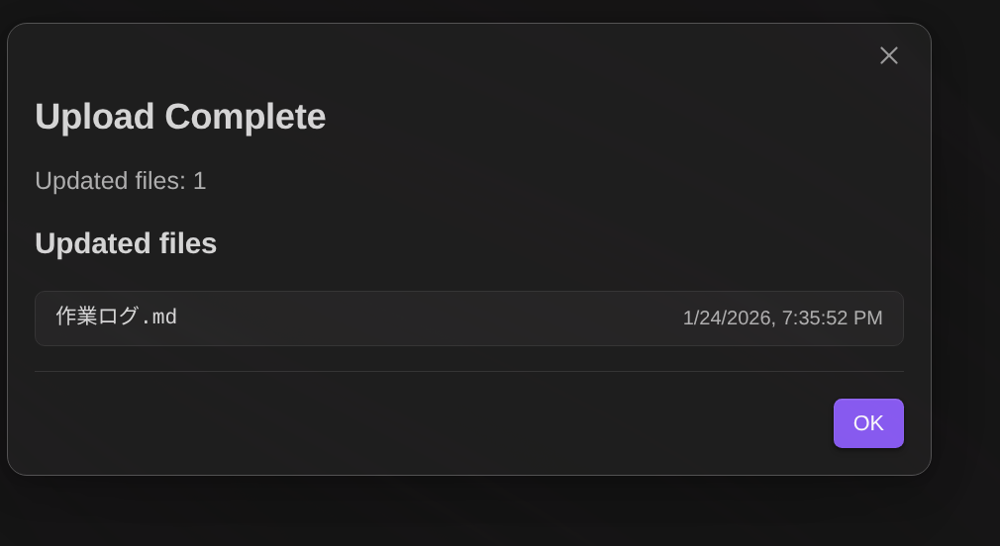

# Obsidian GDrive Vault Plugin

A manual sync plugin for Obsidian that syncs your vault to Google Drive.

## Features

- **Manual Sync**: Push and pull changes when you want
- **Conflict Resolution**: Choose Local or Remote with side-by-side diff view for markdown files
- **Conflict Backup**: Unselected version saved to `sync_conflicts/` folder for manual merging
- **Version Tracking**: Only syncs when there are actual changes
- **Smart Sync**: Full push/pull skips unchanged files by comparing hashes
- **Completion Summary**: Shows list of updated files with modification times
- **Parallel Processing**: Fast uploads/downloads with 5 concurrent operations
- **Cross-Platform**: Works on desktop, Android, and iOS
- **i18n Support**: English and Japanese UI

## Installation

This plugin requires your own OAuth server. Follow these steps:

### 1. Deploy OAuth Server

See [obsidian-oauth/README.md](obsidian-oauth/README.md) for detailed instructions.

1. Create a Google Cloud Project
2. Configure OAuth consent screen and credentials
3. Deploy to Google App Engine

### 2. Build the Plugin

1. Fork this repository
2. Edit `config.ts` with your OAuth server URLs:
   ```typescript
   export const OAUTH_CONFIG = {
     refreshAccessTokenURL: "https://YOUR_PROJECT.appspot.com/auth/obsidian/refresh-token",
     fetchRefreshTokenURL: "https://YOUR_PROJECT.appspot.com/auth/obsidian",
   };
   ```
4. Push to main branch (GitHub Action will create a release)

### 3. Install via BRAT

1. Install [BRAT](https://github.com/TfTHacker/obsidian42-brat) from Community Plugins
2. Open BRAT settings and click "Add Beta plugin"
3. Enter your fork URL: `https://github.com/YOUR_USERNAME/obsidian-gdrive-vault`
4. Click "Add Plugin"

### Manual Installation

1. Download `main.js` and `manifest.json` from your fork's Releases
2. Create folder `.obsidian/plugins/obsidian-gdrive-vault/`
3. Copy the files into the folder
4. Enable the plugin in Obsidian settings

## Setup

1. Open plugin settings and click the Login link
2. Sign in with your Google account and grant permissions
3. Copy the Refresh Token and paste it in settings
4. Reload the plugin
5. Click "Initialize vault" to create your vault folder on Google Drive



For additional devices:
1. Create a vault with the same name
2. Install the plugin from your fork
3. Configure with the same Google account
4. Use **Pull Changes** to download all files

## Usage

### Ribbon Buttons

| Button | Action |
|--------|--------|
| Upload icon | **Push Changes** - Upload local changes to Google Drive |
| Download icon | **Pull Changes** - Download remote changes to local |

### Commands (Command Palette)

| Command | Description |
|---------|-------------|
| `Push changes to Google Drive` | Upload changed files |
| `Pull changes from Google Drive` | Download changed files |
| `Full push to Google Drive` | Upload entire vault (skips unchanged files) |
| `Full pull from Google Drive` | Download entire vault (skips unchanged files) |

Full sync operations compare file hashes and skip files that are already identical, showing a completion dialog with the list of actually updated files.

### Settings

| Setting | Description |
|---------|-------------|
| Exclude patterns | Glob patterns for files to exclude from sync |
| Conflict folder | Directory name for saving unselected conflict versions (default: `sync_conflicts`) |
| Clear conflict files | Delete all files in the conflict folder |
| Remote Excluded Files | View and delete files on remote that match current exclude patterns |
| Full Push | Upload entire vault |
| Full Pull | Download entire vault |



Default exclude patterns:
- `.obsidian/**` - Obsidian config folder
- `.**` - Dot files
- `.*/**` - Dot folders
- `sync_conflicts/**` - Conflict backup folder

## How Sync Works

### Meta Files

The plugin uses meta files to track sync state:

| Location | File |
|----------|------|
| Local | `.obsidian/gdrive-vault-meta.json` |
| Remote | `_gdrive-vault-meta.json` |

Meta file structure:
```json
{
  "lastUpdatedAt": "2024-01-24T10:30:00.000Z",
  "lastSyncTimestamp": "2024-01-24T10:30:00.000Z",
  "files": {
    "notes/daily.md": {
      "hash": "sha256...",
      "modifiedTime": "2024-01-24T09:15:00.000Z"
    }
  }
}
```

### Last Updated Timestamp

- Updated only when files are actually uploaded/deleted
- Used to detect if remote has newer changes
- Displayed in settings for easy reference
- No change = no timestamp update

### Push Changes Flow

1. **No remote meta**: Full upload, create meta with current timestamp
2. **No local meta**: Compare hashes, show conflicts if different, then push
3. **Local newer or same as remote**: Upload changed files, update timestamp
4. **Remote newer than local**: Check for conflicts, show dialog if any

### Pull Changes Flow

1. **No remote meta**: Nothing to pull
2. **No local meta**: Compare hashes, show conflicts if different, then download
3. **Local newer or same as remote**: Nothing to pull
4. **Remote newer than local**: Download changed files, delete removed files

### Conflict Resolution

When both local and remote have changes to the same file:

| Option | Behavior |
|--------|----------|
| Keep Local | Upload local version to remote, save remote to `sync_conflicts/` |
| Keep Remote | Download remote version to local, save local to `sync_conflicts/` |

**Features:**
- **Side-by-side diff view** for markdown files (shows differences between local and remote)
- **Mobile responsive** - vertical layout on narrow screens
- **Backup to conflict folder** - unselected version saved as `sync_conflicts/filename_YYYYMMDD_HHMMSS.ext`
- **Manual merge support** - use the backup files to manually merge changes if needed

The conflict folder is automatically excluded from sync. Delete backup files when no longer needed via settings or manually.

### Sync Completion Dialog

After sync completes, a dialog shows the list of files that were actually transferred:



**Push Changes:**
- Shows files that were **uploaded** to Google Drive
- Files where "Keep Remote" was selected are NOT shown (only backed up locally)

**Pull Changes:**
- Shows files that were **downloaded** from Google Drive
- Files where "Keep Local" was selected are NOT shown (only remote is backed up to conflict folder)

**Full Push/Pull:**
- Shows all files that were actually transferred
- Displays count of skipped files (unchanged files with matching hash)

The dialog requires clicking "OK" to close, ensuring you see the sync results.

## FAQ

### Does this work on mobile?

Yes! Works on Android and iOS. Install the same way as desktop.

### Must vault names match across devices?

Yes. The plugin uses vault name to identify which vault to sync.

### Can I add files directly to Google Drive?

No. The plugin can only access files it created (security restriction).

### Why are files stored flat in Google Drive?

Simpler implementation. Obsidian recreates folder structure from filenames like `folder/subfolder/note.md`.

### How do I exclude files?

Add glob patterns in settings:
- `*.tmp` - Exclude .tmp files
- `drafts/**` - Exclude drafts folder
- `**/private/**` - Exclude any "private" folder

### What happens to excluded files already on remote?

Excluded files remain on Google Drive intentionally. This allows different devices to use different exclude patterns. For example:
- Desktop A: syncs everything
- Desktop B: excludes `large-assets/**`
- Mobile: excludes `large-assets/**` and `archives/**`

Each device only downloads/uploads files matching its own exclude patterns, but files excluded on one device can still be synced between other devices.

To clean up excluded files from remote, use **Manage Remote Excluded Files** in settings.

## Troubleshooting

1. Check that the plugin is enabled
2. Verify refresh token is correct
3. Check internet connection
4. View console for error messages (Ctrl+Shift+I)

## Support

- [GitHub Issues](https://github.com/takeshy/obsidian-gdrive-vault/issues)
- [Discord Server](https://discord.com/invite/dPasX4Ac2P)

## License

MIT
